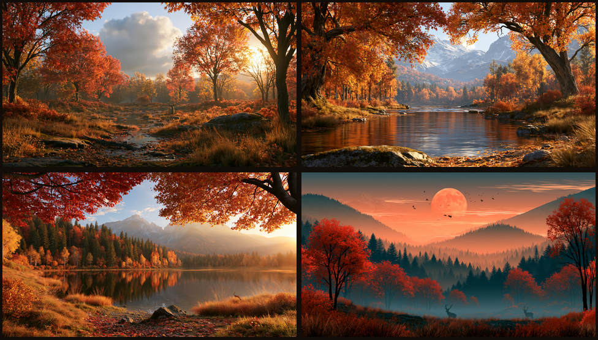

# Autumn — an Omarchy theme for fall 🍂

A warm, cozy fall theme for [Omarchy](https://omarchy.org): roasted-brown
backgrounds, cream foreground, and a burnt-orange accent, with a terminal
palette of rust, amber, olive, and sage.


## Install

```bash
omarchy theme install https://github.com/SirJul1337/omarchy-autumn-theme.git
```

That's it — the theme is applied immediately as **Autumn**.

## What's included

- **Colors** — full `colors.toml` driving the bar, terminals, notifications, and apps
- **Backgrounds** — four autumn landscapes plus a subtle ember-bokeh wallpaper
- **Neovim** — [melange](https://github.com/savq/melange-nvim) colorscheme
- **VS Code** — Gruvbox Material Dark
- **Icons** — Yaru-wartybrown


